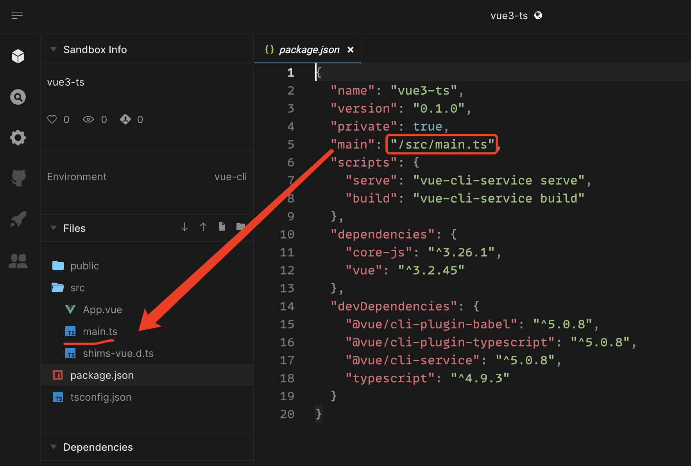
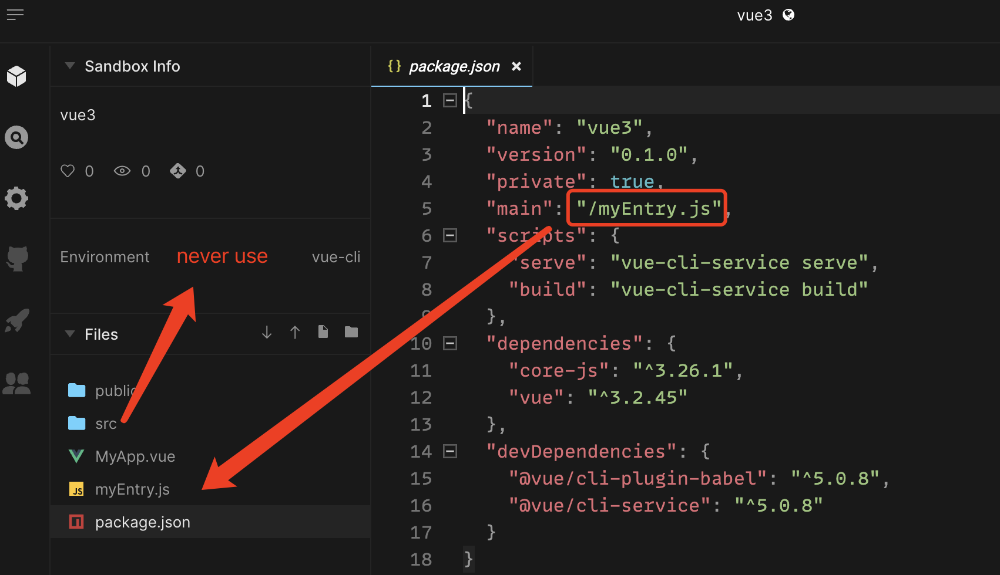

# Entry File

> this section is the basis of usage

The entry file is the starting point of the bundle process.

If you change the path of the entry file, make sure you control all the files that go into the bundle process, as prexisting settings in the template might not work anymore.

## Default entry file

> the `javascript` is also called `vanilla`.

- vanilla: `/src/index.js`
- vanilla-ts: `/src/index.ts`
- vue: `/src/main.js`
- vue3: `/src/main.js`
- vue3-ts: `/src/main.ts`
- react: `/index.js`
- react-ts: `/index.ts`
- angular: `/src/main.ts`
- solid: `/index.tsx`
- svelte: `/index.js`
- test-ts: `/add.test.ts`

### usage

For example, like `vue3-ts`

<script setup>
import vue3ts from '../codes/basic-usage/vue3tsEntry.ts';
import vue3tsCustom from '../codes/basic-usage/vue3tsCustomEntry.ts';
</script>

::: details markdown code
<CodePanel :value="vue3ts" />
:::

::: sandbox {template=vue3-ts}
:::

you can click this button to open codesandbox.


you can see, the file directory looks like this.



## Custom entry file

also `vue3-ts`, we can change the entry file (named `myEntry.js`) to root directory.

`MyApp.vue` also in root directory.

replace `/MyApp.vue` to `/src/MyApp.vue`, it can move to the src folder.

::: details markdown code
<CodePanel :value="vue3tsCustom" />
:::

::: sandbox {entry=/myEntry.js}
```js /myEntry.js [active]
import { createApp } from 'vue'
import App from './MyApp.vue'

console.log('test entry')
createApp(App).mount('#app')
```

```vue /MyApp.vue
<script setup>
import { ref } from 'vue';

const msg = ref('MyApp');
</script>

<template>
  <div>{{ msg }}</div>
</template>
```
:::

you can see, the file directory looks like this. and files in src will not be used.


