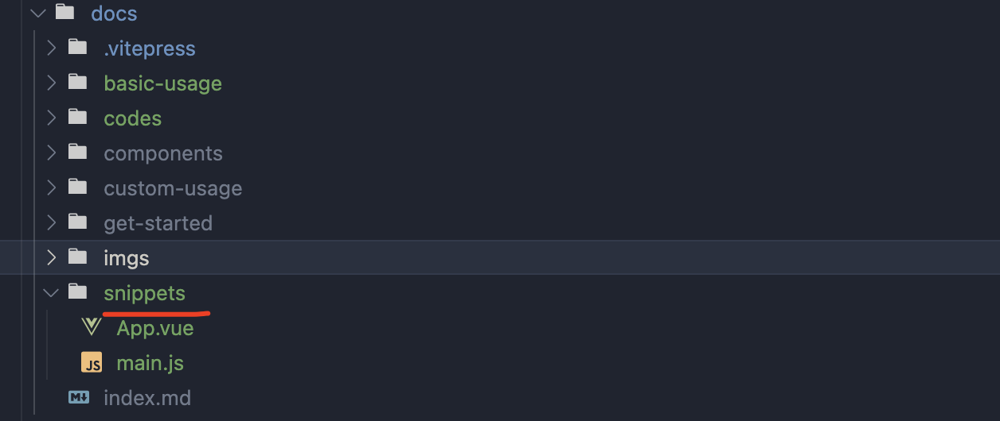

# Use snippets

## setup

- create a folder, for example: `snippets`
- create your file snippets

*Floders are*:



## basic

<<< @/codes/basic-usage/snippets.md

> *`prefix` default to `/`*

::: sandbox {entry=/main.js}
<<< @/snippets/App.vue{#active}

<<< @/snippets/main.js
:::

<br />

::: sandbox
<<< @/snippets/App.vue{prefix=/src/}

<<< @/snippets/main.js{prefix=/src/}
:::

## active by file

For example, active the `/src/main.js`

<<< @/codes/basic-usage/snippets-1.md

::: sandbox
<<< @/snippets/App.vue{prefix=/src/}

<<< @/snippets/main.js{prefix=#active/src/}
:::

## readOnly by file

For example, active the `/src/main.js`

<<< @/codes/basic-usage/snippets-2.md

::: sandbox
<<< @/snippets/App.vue{prefix=#readOnly/src/}

<<< @/snippets/main.js{prefix=/src/}
:::

## active & readOnly by file

For example, active the `/src/main.js`

<<< @/codes/basic-usage/snippets-3.md

::: sandbox
<<< @/snippets/App.vue{prefix=/src/}

<<< @/snippets/main.js{prefix=#active#readOnly/src/}
:::

## hidde some file

<<< @/codes/basic-usage/snippets-4.md

::: sandbox {template=react}
<<< @/snippets/App.js{#hidden}

```js /Clock.js [active]
export default function Clock({ color, time }) {
  return (
    <h1 style={{ color: color }}>
      {time}
    </h1>
  );
}
```
:::
